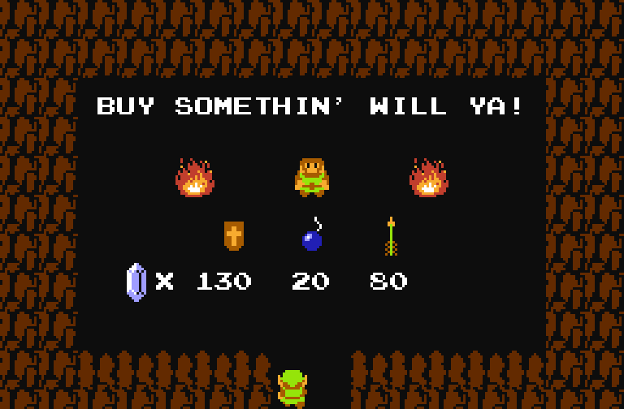

# Zelda Shop
This Ethereum project imagines a Zelda Shop point of sale with SKALE interchain messaging

Demo the project at https://djrosenbaum.github.io/zelda-shop/

# Usage
Part 1: The Bank
1. Get yourself some Rinkeby ETH
2. Connect your provider to the Rinkeby Network and visit the [Demo](https://djrosenbaum.github.io/zelda-shop/)
3. Deposit ETH in the Bank

Part 2: The Shop
1. Get yourself some SKALE ETH using the faucet http://faucet.skalelabs.com/
2. Enter SKALE Endpoint as http://ethboston0.skalenodes.com:10167
3. Switch your provider network to Custom RPC http://ethboston0.skalenodes.com:10167
4. While connected to the SKALE network visit the [Demo](https://djrosenbaum.github.io/zelda-shop/)
5. Approve and Buy some Arrows

Part 3. Going for the Exit
1. Visit the shop from part 2 and Exit to Mainnet
2. Visit the bank from part 1 and Withdraw Available Funds

# Custom RPC Alternative endpoints
http://ethboston0.skalenodes.com:10167
https://ethboston0.skalenodes.com:10172

http://ethboston1.skalenodes.com:10167
https://ethboston1.skalenodes.com:10172

# Links
Demo
https://djrosenbaum.github.io/zelda-shop/

ethereal
https://gitcoin.co/hackathon/ethereal-blocks/

interchain messaging
https://developers.skalelabs.com/interchain-messaging-agent

SKALE Faucet
http://faucet.skalelabs.com/

SKALE Block Explorer
http://explorer.skalelabs.com/